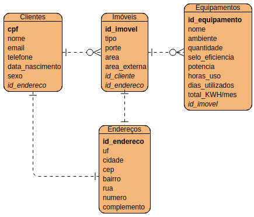

# Documento de visão

## Equipe e definição dos papéis

Membro    |   Papel    |  E-mail  |
--------- | ---------  |--------- |
Robson    | Analista, testador, desenvolvedor, cliente | pakrobson@gmail.com | 

## Perfis de usuários

Perfil | Descrição |
--------- | --------- |
Administrador | Esse usuário pode casdastrar clientes e seus respectivos imóveis, assim como preencher-lo com equipamentos que estão presentes em cada ambiente. Veficar informações de consumo, configurar tafiras e informações estratégicas. |

## Lista de requisitos funcionais

Requisito                                 | Descrição   | Ator |
---------                                 | ----------- | ---------- |
RF001 - Manter um cadastro de clientes    | Um cliente possuí: cpf ou cnpj, email, telefone, data de nascimento, sexo e um endereço| Administrador |
RF002 - Manter um cadastro de imóveis | Os imóveis são divididos em dois tipo: residencial e empresarial. Ambos possuí: Porte, endereço, área, se possui área externa e ambientes (comodos), empresas tem o campo de maquinário | Administrador |
RF003 - Manter o cadastro de equipamentos| Um equpamento possuí: um nome, ambiente, quantidade, selo de eficiência, potência, horas de uso por dia, dias utilizados no mês, KWH/mês (calculável) | Administrador |
RF004 - Informar consumo de equipamentos (KWh/mês) | Para cada equipamento informa: quantidade, consumo (KWh/mês), consumo (porcentagem). Além de informar o consumo graficamente | Administrador |
RF005 - Informar consumo dos ambientes (KWh/mês)  | Mostrar o consumo em porcentagem e em KWh/mês de cada por cada ambiente. Exibir também em forma de gráfico | Administrador |
RF006 - Configurar tarifa | A tarifa pode ser convecional (tem valor (R$/KWh)) ou branca (possui: ponta (R$/KWh), intermediário (R$/KWh) e fora de ponta (R$/KWh)) podendo ajustar esses valores, assim como, badeira, ICMS, PIS, CONFINS | Administrador |
RF007 - Informar consumo de equipamentos (R$) | Para cada equipamento informa: Consumo (KWh/mês), valor (R$/KWh), porcentagem (R$/KWh) de acordo com os valores da tarifa. Além de informar o consumo graficamente | Administrador |
RF008 - Informar consumo dos ambientes (R$)  | Mostrar o consumo (KWh/mês), valor (R$/KWh) e porcentagem ) (R$/KWh) de cada ambiente. Exibir também em forma de gráfico | Administrador |
RF009 - Histórico de consumo | Exibir hitórico de consumo de um cliente em cada mês em KWH ou R$ | Administrador |
RF010 - Quantidade de clinete | Exibir a quantidade de clientes por mês | Administrador |

### Modelo Conceitual

Abaixo se encontra o modelo entidade relacionamento do projeto de serviço de assessoria energética.

 

## Lista de requisitos não-funcionais

Requisito | Descrição |
--------- | --------- |
RNF001 - Realizar backup | O sistema deve realizar backup periodicamente. |
RNF002 - Possuir uma UI intuitiva | A interface do usuário deve ser intuitiva para ter uma maior eficiência. |
RNF003 - Segurança das informações | Os dados de cada usuário deve permanecer seguros.
  
